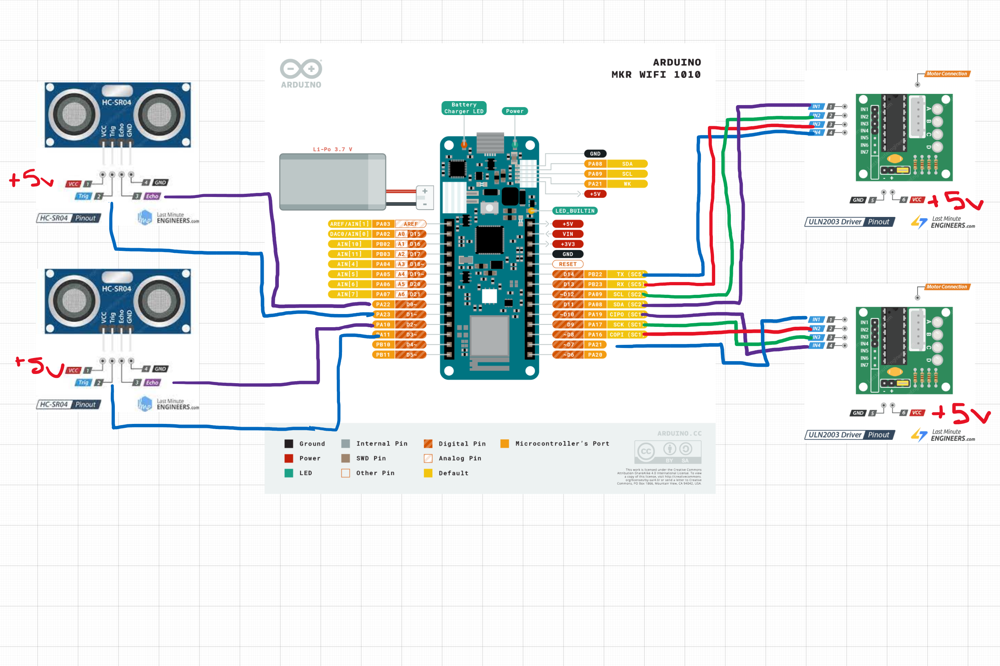

# TestCeilingCart
This file contains the code required for a dual motor ceiling cart.

It is recommended to power everything off of a single 5V source as opposed to powering the Arduino and using it to power the stepper motors as that may introduce instability.
